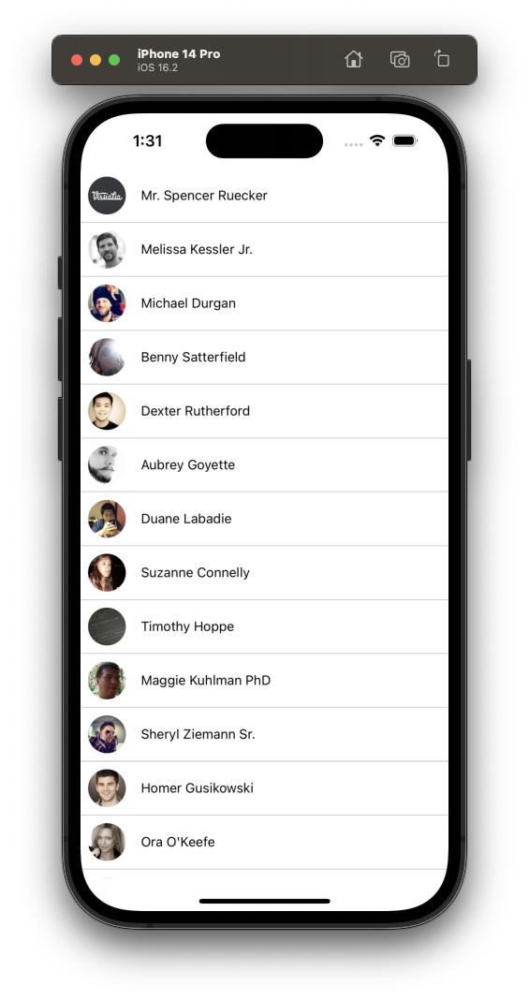

# Build a screen

In this chapter, we will create the first screen of the Contact app.

<p align="center">
  
</p>

The screen above display a list of an image and text. The app user can scroll up or down to view more contacts.

# Step 1: Break down the screen

Before we build this screen by writing code, let’s break it down into some essential elements. Most of these elements directly correspond to the built-in [Core Components](https://reactnative.dev/docs/components-and-apis) from React Native.

This screen consists of a list of contact row. Let’s take a look at each contact row.

<p align="center">
  
</p>

There are 2 essential elements:

1. The image showing contact photo
2. The text showing the name of the contact

In React Native, styling is done using JavaScript as compared to the web, where CSS is used. Most of the React Native core components accept a `style` prop that accepts a JavaScript object as its value. For detailed information on styling, see [Styling in React Native.](https://reactnative.dev/docs/style)

Now that we’ve broken down the UI into smaller chunks, we’re ready to start coding.

# Step 2: Display the image

We can use React Native’s `<Image/>` component to display the image in the app. The `<Image />` component requires a source of an image. This source can be a static asset or a URL. For example, the source can be required from the app’s `./assets/images` directory, or the source can come from the Network in the form of a `uri` property.

First, let’s create a mock contact.

```tsx
// App.tsx

type Contact = {
  id: string
  name: string
  image: string
  tel: string
}

// This is a mock contact
const contact: Contact = {
  id: "1",
  name: "Theerapat Muangpoon",
  image: "https://i.pravatar.cc/150?img=3",
  tel: "0987654321",
}
```

Next, import and use the `<Image />` component from React Native. Let’s also add styles to display the image.

```tsx
// App.tsx

export default function App() {
  return (
    <View style={styles.container}>
      <Image source={{ uri: contact.image }} style={styles.contactImage} />
      <StatusBar style="auto" />
    </View>
  )
}

const styles = StyleSheet.create({
  container: {
    flex: 1,
    backgroundColor: "#fff",
  },
  contactImage: {
    width: 40,
    height: 40,
    borderRadius: 20,
    marginRight: 16,
  },
})
```

You’ll notice that the image is at the top (notch area) and maybe placed too high for our liking. Then we need to replace `<View/>` with `<SafeAreaView />` component to keep everything under the notch area.

```tsx
import { SafeAreaView } from 'react-native'

export default function App() {
  return (
		<SafeAreaView style={styles.container} >
	    <Image source={{ uri: contact.image }} style={styles.contactImage} />
	    <StatusBar style="auto" />
		</SafeAreaView>
  )
}

const styles = StyleSheet.create({
  container: {
    flex: 1,
  },
	...
})
```

# Step 3: Display contact name

We then will use `<Text />` component from React Native core component to display text.

```tsx
export default function App() {
  return (
    <SafeAreaView style={styles.container}>
      <Image source={{ uri: contact.image }} style={styles.contactImage} />
      <Text>{contact.name}</Text>
      <StatusBar style="auto" />
    </SafeAreaView>
  )
}
```

<p align="center">
  
</p>

# Step 4: Style contact row to make the image and text side-by-side

To style the contact row to have the content side by side, we’ll set `flexDirection` of the container to be `row`.

```tsx
export default function App() {
  return (
		<SafeAreaView style={styles.container} >
	    <View style={styles.contactContainer}>
	      <Image source={{ uri: contact.image }} style={styles.contactImage} />
				<Text>{contact.name}</Text>
	    </View>
			<StatusBar style="auto" />
		</SafeAreaView>
  )
}

const styles = StyleSheet.create({
  ...
	contactContainer: {
		flexDirection: "row",
    alignItems: "center",
    padding: 8,
	}
	...
})
```

# Step 5: Dividing components into files

As we add more components to this screen, let’s divide the code into multiple files:

- Create a `contact` directory at the root of the project. This will contain all the code related to contact throughout this tutorial
- Then, create a new file called `ContactRow.tsx` inside the `contact` folder.
- Move the code to display the `ContactRow` in this file along with the style.

```tsx
// contact/contact.ts

// Move Contact type into contact.ts file
export type Contact = {
  id: string
  name: string
  image: string
  tel: string
}
```

```tsx
// contact/ContactRow.tsx

import { Image, StyleSheet, Text, View } from "react-native"
import { Contact } from "./contact"

type Props = {
  contact: Contact
}

const ContactRow = ({ contact }: Props) => {
  return (
    <View style={styles.contact}>
      <Image source={{ uri: contact.image }} style={styles.contactImage} />
      <Text>{contact.name}</Text>
    </View>
  )
}

const styles = StyleSheet.create({
  contact: {
    flexDirection: "row",
    alignItems: "center",
    padding: 8,
  },
  contactImage: {
    width: 40,
    height: 40,
    borderRadius: 20,
    marginRight: 16,
  },
})

export default ContactRow
```

This `ContactRow` component accepts `contact` as a `prop`. When we re-use this component somewhere else, we’ll need to pass in `contact` prop to make it work.

Next, let’s import this component and use it in the `App.tsx`

```tsx
// App.tsx

import { StatusBar } from "expo-status-bar"
import { SafeAreaView, StyleSheet } from "react-native"
import { Contact } from "./contact/contact"
import ContactRow from "./contact/ContactRow"

const contact: Contact = {
  id: "1",
  name: "Theerapat Muangpoon",
  image: "https://i.pravatar.cc/150?img=3",
  tel: "0987654321",
}

export default function App() {
  return (
    <SafeAreaView style={styles.container}>
      <ContactRow contact={contact} />
      <StatusBar style="auto" />
    </SafeAreaView>
  )
}

const styles = StyleSheet.create({
  container: {
    flex: 1,
    backgroundColor: "#fff",
  },
})
```

# Step 6: Display contact list

We are going to use React Native’s `FlatList` component to render multiple `ContactRow` components.

But first, we’ll need to create a lot of contacts. Starting from installing a new dependency to help up generate fake contacts

```bash
npm install @faker-js/faker
```

\*Make sure to restart Metro server to allow the app uses the installed dependencies.

Then, we are going to use this library to create a contact list

```tsx
import { faker } from "@faker-js/faker"

export type Contact = {
  id: string
  name: string
  image: string
  tel: string
}

const createRandomContact = (): Contact => ({
  id: faker.datatype.uuid(),
  name: faker.name.fullName(),
  image: faker.image.avatar(),
  tel: faker.phone.number("+66 #-####-####"),
})

// This is a contact list data that we're going to use later
export const mockContacts: Contact[] = Array.from({ length: 20 }).map(() =>
  createRandomContact()
)
```

Next, we’ll use `FlatList` component to render our `ContactRow.` This component will render list of `ContactRow` and allow us to scroll the list if the list is too long.

Let’s take a look at each props passed into `FlatList`

- `data`: accepts data as an array. In this case, our `mockContacts` is an array of contacts
- `renderrItem`: renders component with each data (`item`) from data array. In this case, it renders `ContactRow` with each contact from `mockContacts`.
- `keyExtractor`: tells the list to use the `id`s for the react keys instead of the default `key` property.
- `ItemSeparatorComponent`: divide each component. In our case, we’ll separate each `ContactRow` with a horizontal black space, therefore `Separator` component is used.

```tsx
// App.tsx

import { StatusBar } from "expo-status-bar"
import { FlatList, StyleSheet, SafeAreaView } from "react-native"
import { mockContacts } from "./contact/contact"
import ContactRow from "./contact/ContactRow"

const Separator = () => {
  return <View style={styles.separator} />
}

export default function App() {
  return (
    <SafeAreaView style={styles.container}>
      <FlatList
        data={mockContacts}
        renderItem={({ item }) => <ContactRow contact={item} />}
        keyExtractor={(item) => item.id}
        ItemSeparatorComponent={Separator}
      />
      <StatusBar style="auto" />
    </SafeAreaView>
  )
}

const styles = StyleSheet.create({
  container: {
    flex: 1,
    backgroundColor: "#fff",
  },
  separator: {
    height: 1,
    backgroundColor: "#CED0CE",
  },
})
```

# Next steps

We implemented the first screen of our app. In the next chapter, we’ll add the functionality to navigate between the screens.
