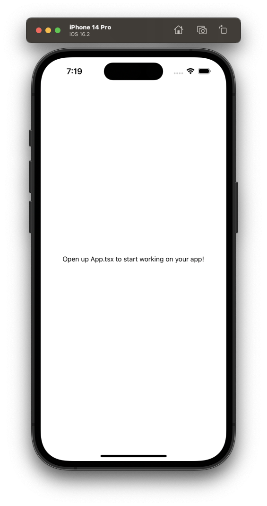

# Create your first app

# Step 1: Initialize a new Expo app

We will use `create-expo-app` to initialize a new Expo app. It is a command line tool that allows to create a new React Native project with the `expo` package installed.

It will create a new project directory and install all the necessary dependencies to get the project up and running locally. Run the following command in your terminal:

```bash
# Create a project named ContactApp
npx create-expo-app ContactApp

# Navigate to the project directory
cd ContactApp
```

This command will create a new directory for the project with the name: **ContactApp**

# Step 2: Run the app on mobile and web

In the project directory, run the following command to start a development server from the terminal:

```bash
npx expo start
```

Once the development server is running, the easiest way to launch the app is on a physical device with Expo Go. Use the physical device to scan a QR Code on the terminal to launch the app.

Once it is running, the project should look like this:

<p align="center">
  
</p>

The text displayed on the app’s screen above can be found in the `App.tsx` file which is at the root of the project’s directory. It is the entry point of the project and is executed when the development server starts.

# Next steps

We have created a new Expo project and are ready to develop our Contact app. In the next chapter, we’ll learn how to build the app’s first screen.
