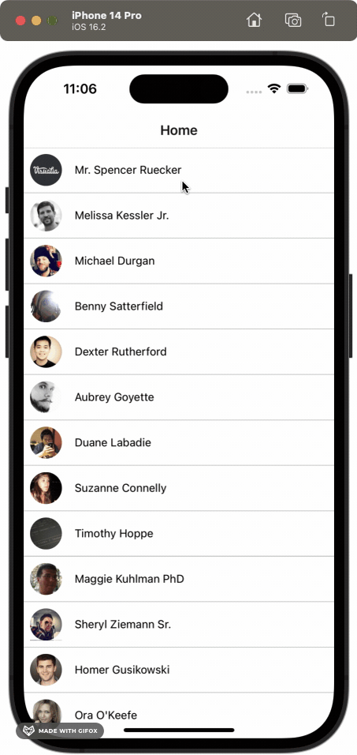

# Introduction

The objective of this tutorial is to get started with React Native and become familiar with the React Native APIs. It’ll cover the following topics:

- Create an Expo App
- Break down the app layout and implement it with flexbox.

Before we get started, take a look at what we’ll build. It’s an app named **Contact** that runs on both Android and iOS. It’s an app which shows a list of contacts and you can press to see each contact details.

  

