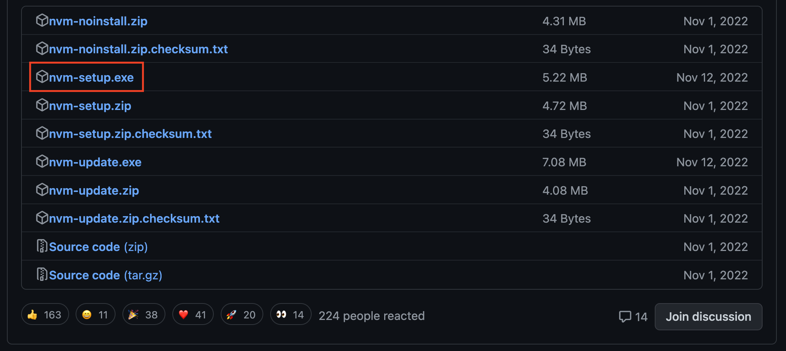
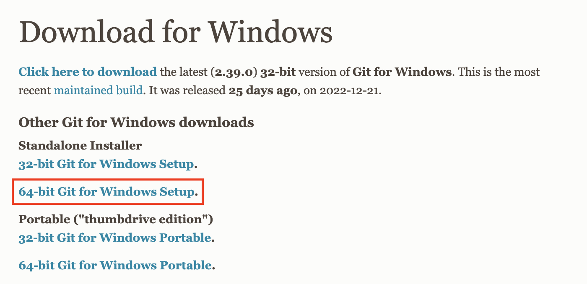

# Prerequisite

## Windows

1. Install NVM for Windows (https://github.com/coreybutler/nvm-windows/releases)

   <p align="center">
      
   </p>

2. Install NodeJS LTS
   - Open Windows terminal then run

```bash
nvm install 18.13.0
nvm use 18.13.0
```

3. Download Git from [https://git-scm.com/download/win](https://git-scm.com/download/win)

   <p align="center">
      
   </p>
